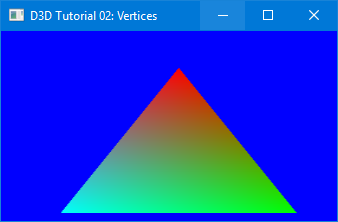
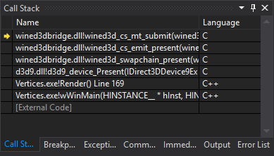

# WineD3DBridge
WineD3DBridge is a native D3D to OpenGL bridge based on WineD3D.
WineD3D is a compatibility layer for running Windows D3D applications on POSIX-compliant OSs like Linux. Although Windows supports DirectX natively, we still need wrap D3D applications to OpenGL ones on Windows in some cases.

Basically, we can make system more backwards compatible for old D3D even DDraw applications with WineD3DBridge, especially on Windows 8 and newer versions. Also, for developing purpose, as there is no open source software rendering emulator for D3D, we can use WineD3DBridge to re-direct the API calls to Mesa3D, which is an open source software renderer implementation.

Generally, a GNU/Linux is required for building WineD3D. While you can build this WineD3DBridge on Windows natively using Visual Studio, with native D3DSDK and Windows platform SDK, and you even don't need to download any 3rd party library.

Instruction
-----------

- Build WineD3DBridge.
- Copy generated wind3d.dll and d3dx dlls (eg: d3d8.dll, d3d9.dll, etc.) to applications directory.
- Run application.

  NOTE:
  - Please do NOT copy dlls to Windows\\System32 or Windows\\SysWoW64, otherwise system will encounter unpredictable problems.
  - if using Mesa3D, please also copy mesa(opengl32.dll) to the same directory.

Snapshot
--------

Thanks and more
---------------
I borrowed many code from WineD3D, thanks to the wine team, and you get more information there: https://www.winehq.org/
